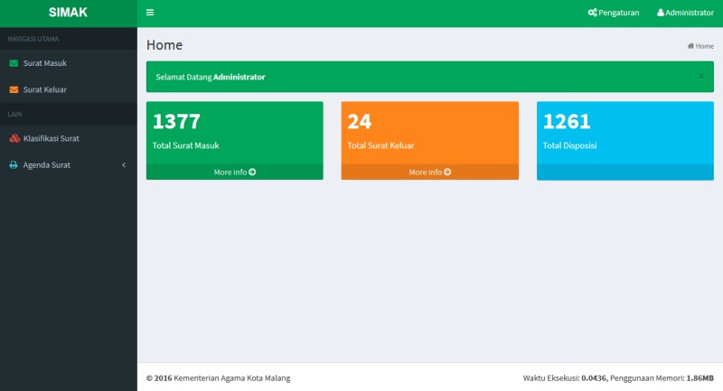

# SIMAK - Sistem Informasi Surat Masuk dan Keluar

## Deskripsi

[SIMAK](https://github.com/farisfebrianto/simak) singkatan dari Sistem Informasi Surat Masuk dan Keluar merupakan aplikasi web CodeIgniter berdasarkan dari aplikasi [ASAMURAT](https://github.com/akhwan90/asamurat) untuk memenuhi projek PKL di Kemenag Kota Malang tahun 2016. Download full documentation at [here](https://github.com/farisfebrianto/simak/raw/master/simak.pdf).

## Screenshot

## Changelog

1. Penghilangan login menggunakan tahun
2. Upgrade CI 3.1.2
3. Template menggunakan AdminLTE
4. Penambahan halaman manage divisi
5. Penambahan fungsi word_limiter pada MY_helper untuk menata tampilan tabel
6. Penambahan fungsi message_box pada MY_helper untuk menampilkan flashdata
7. dan ubahan kecil lain.

## Install

1. Create database dengan nama simak pada phpmyadmin
2. Import database simak.sql
3. user:admin password:rahasia
4. Jika mengalami masalah pada file attachment, simply because not included bigger file.
